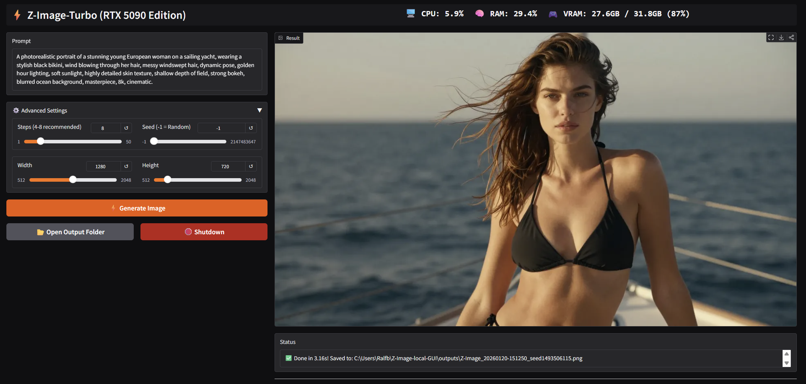

## Z-Image-Turbo Local GUI (Windows) ⚡

A lightning-fast local Gradio Web-UI for the Z-Image-Turbo model. Generate photorealistic images in milliseconds using the power of your local GPU.

**Optimized for NVIDIA RTX 50-Series (Blackwell) & CUDA 13.0.**



*(Generated locally in seconds)*

---

## ✨ Features

- ⚡ **Turbo Speed**: Generates high-quality images in just 4-8 steps.
- 📦 **Fully Portable**: Embedded Python — no system Python installation required.
- 📊 **Real-Time Monitor**: Live display of CPU, RAM, and VRAM usage.
- 🖼️ **Full Control**: Adjustable Resolution (up to 2048x2048), Steps, and Seed.
- 💾 **Auto-Save**: Results are automatically saved to the `outputs` folder.
- 📂 **Quick Access**: Open the output folder directly from the UI.
- 🛄 **Local Model Cache**: Model is downloaded once to `model_cache/` — no internet needed after first run.

---

## 📋 Prerequisites

- **OS**: Windows 10/11
- **GPU**: NVIDIA RTX 3090 / 4090 / 5090 (16GB+ VRAM recommended)

---

## ⚙️ Installation

1. Download this repository as a ZIP file and extract it.
2. Double-click `install.bat`.
   * The script automatically downloads an isolated Python 3.11 environment.
   * It installs PyTorch Nightly (required for Blackwell / RTX 50 Series support).
3. Wait until the installation is complete.

No system Python and no virtual environment required.

---

## 🚀 Usage

1. Double-click `start_z_image_lokal_gui.bat`.
2. On the **first run**, the model (~6GB) is downloaded directly into the `model_cache/` folder inside the project directory.
3. On every **subsequent run**, the model loads instantly from the local cache — no internet connection required.
4. The GUI will open automatically in your browser (usually `http://127.0.0.1:7860`).

---

## ⚙️ Recommended Settings

- **Steps**: 4-8 steps is the sweet spot.
- **Resolution**: 1024×1024 works best.

---

## 📂 Folder Structure

After installation and first run, your folder will look like this:

```
Z-Image-Local-GUI/
├── app.py                          # Main application
├── install.bat                     # One-click installer
├── start_z_image_lokal_gui.bat     # Launch script
├── requirements.txt                # Python dependencies
├── python_env/                     # Isolated Python 3.11 (created by install.bat)
├── model_cache/                    # Z-Image-Turbo model (~6GB, downloaded on first run)
└── outputs/                        # Generated images (auto-created)
```

---

## 🔧 Troubleshooting

* **OOM (Out of Memory)** – Ensure you don't have other heavy GPU apps running.
* **Python environment not found** – Make sure you ran `install.bat` before starting the app.

---

## 🔗 Credits

- **Model**: [Tongyi-MAI/Z-Image-Turbo](https://huggingface.co/Tongyi-MAI/Z-Image-Turbo)
- **Library**: [Hugging Face Diffusers](https://github.com/huggingface/diffusers)

---

## 🤝 Support

This is a free open-source project. I don't ask for donations.
However, if you want to say "Thanks", check out my profile on **[Spotify](https://open.spotify.com/artist/7EdK2cuIo7xTAacutHs9gv?si=4AqQE6GcQpKJFeVk6gJ06g)**.
A follow or a listen is the best way to support me! 🎧
